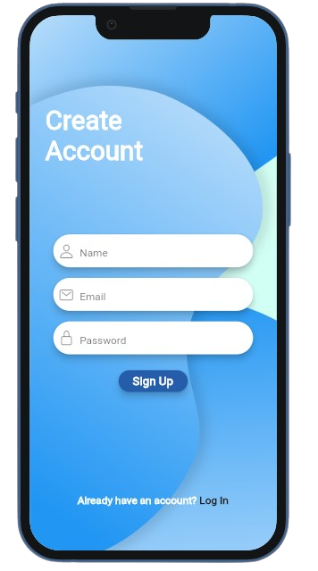
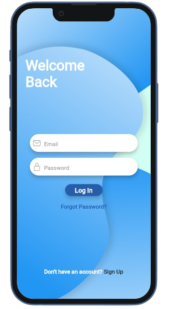
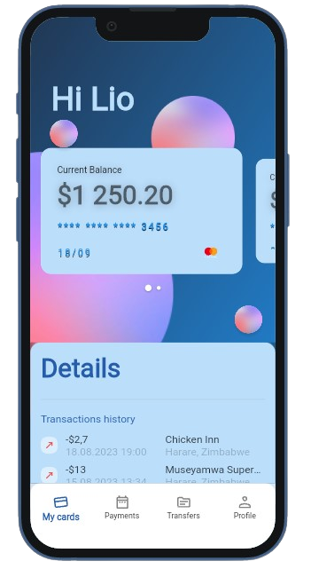
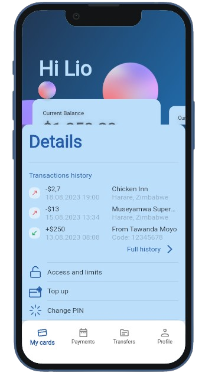

# Bank-app-ui

Fictional Bank Mobile Application User Interface implemented using Flutter

# Try It

https://bank-app-ui.web.app

## Create Account Screen

## Login Screen

## My Card Screen

## My Cards Screen

